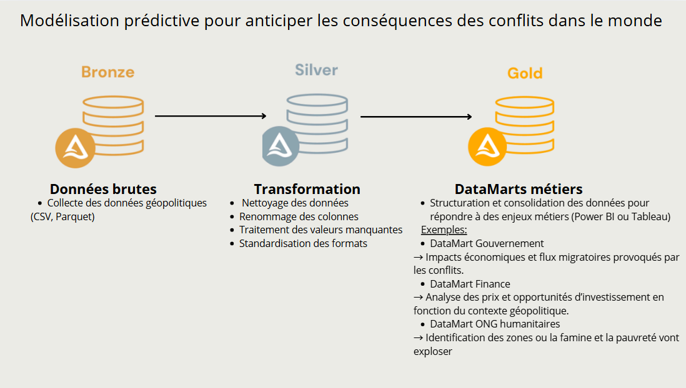

- dataset = fichier .csv nommer dataset.csv
lien kaggle : https://www.kaggle.com/datasets/likithagedipudi/war-economic-and-livelihood-impact-dataset?resource=download

- dossiers RAW / silver non necessaire car deja effectuer avec le HDFS

